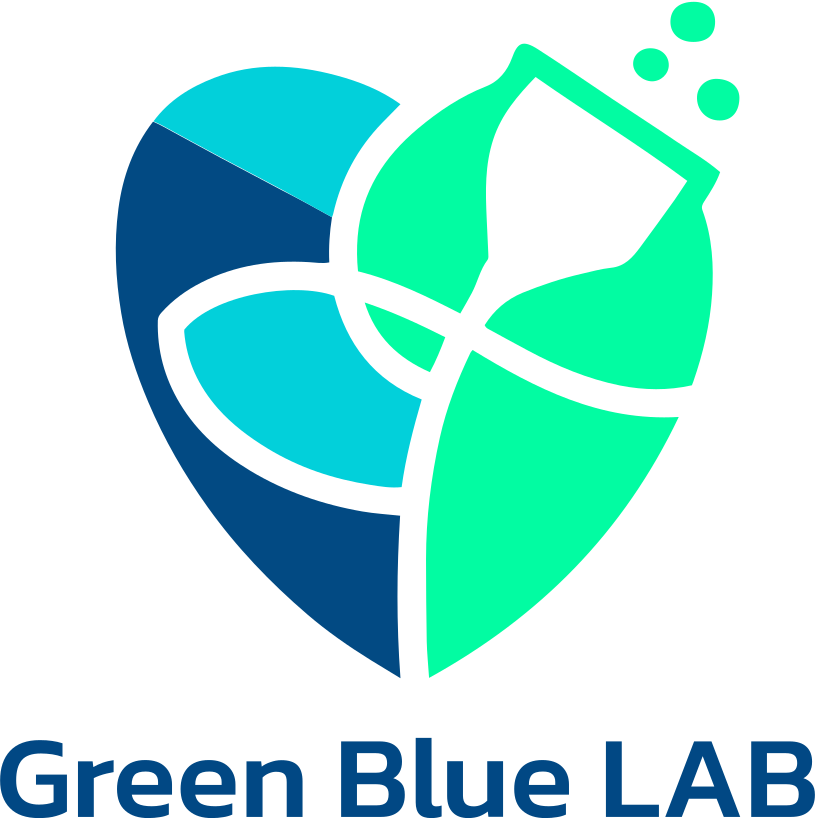
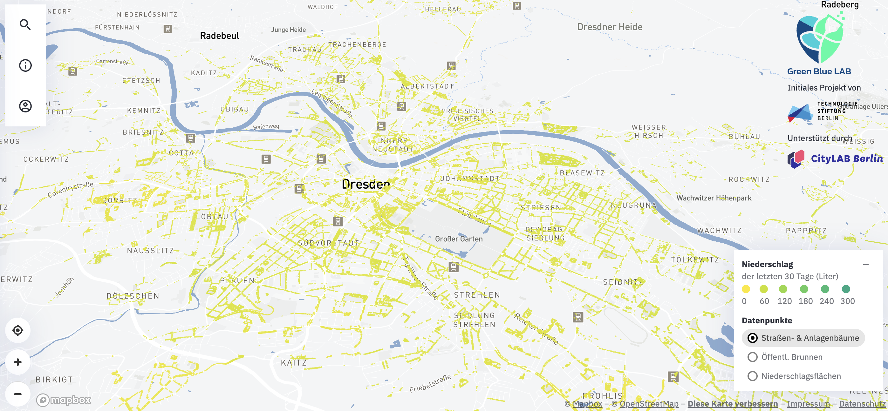

  

# 

---

## About [GreenBlueLab](https://www.greenbluelab.de)

The consequences of climate change, especially the dry and hot summers, are putting a strain on city's ecosystem. Our urban trees are drying out and suffering long-term damage: In recent years, more and more trees have had to be cut down and their lifespan is declining. In the meantime, the population is regularly called upon to help, but largely uncoordinated. 

[_Gieß den Kiez_](https://www.giessdenkiez.de) is was made to change that and enable coordinated citizen\* participation in the irrigation of urban trees. This project was made by the [Technologiestiftung Berlin](https://www.technologiestiftung-berlin.de/de/startseite/) and the [CityLAB Berlin](https://www.citylab-berlin.org/). 

[GreenBlueLab](https://www.greenbluelab.de) wants to go one step further and make this app available for other cities as well.

---

## Repositories

This project is composed of multiple repositories:

- [React frontend (this is here)](https://github.com/greenbluelab/musterstadt-giesst)
- [Database API](https://github.com/greenbluelab/musterstadt-giesst-api)
- [DWD Harvester](https://github.com/greenbluelab/musterstadt-giesst-dwd-harvester)
- [OSM Harvester](https://github.com/greenbluelab/musterstadt-giesst-osm-pumpen-harvester)
- [New DWD and Tree Harvester](https://github.com/greenbluelab/musterstadt-giesst-treedata)
